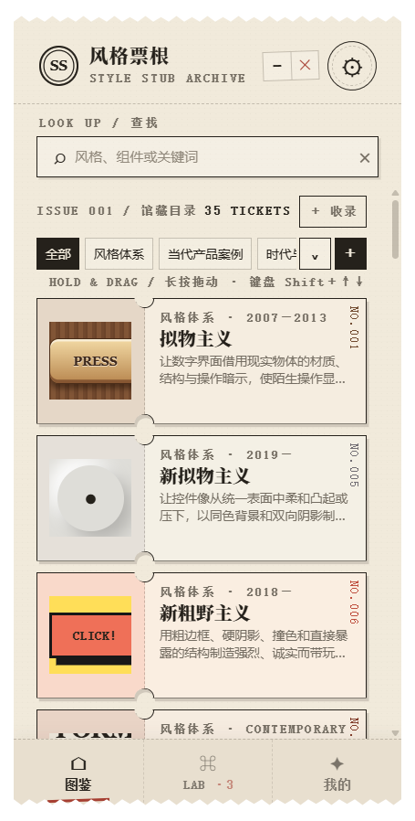

# Style Stub / 风格票根

把模糊的审美偏好，变成可以查阅、组合、保存和直接交给 AI 的视觉规则。

Style Stub 是一款放在 Windows 桌面侧边使用的视觉风格图鉴与 Prompt 实验室。它把每种风格做成一张可展开的票根：上方是原创 CSS 小样，下方是定义、视觉机制、适用场景、避坑规则和可复制的中英文 UI Prompt。



## 它能做什么

- 浏览 35 个内置风格、设计流派、平台时代与当代产品案例
- 用别名、关键词和近似拼写搜索馆藏
- 展开票根，查看定义、视觉特征、组件语法和完整 Prompt
- 把 2–4 种风格加入 Lab，自由调整份量并自动换算百分比
- 保存 Lab 配方，或从 1–4 张例图提取自己的个人风格
- 使用自己的千问 Key 完成“看图提取 → 不看图复审”，减少对原产品内容的照搬
- 在 Windows 桌面置顶、贴边、记忆位置，并隐藏到系统托盘

所有个人风格、图片封面与 Lab 数据默认只保存在本机。桌面版 API Key 由 Windows 用户级加密保存，不会写入仓库、网页存储或日志。

## 快速开始

需要 Node.js 20 或更新版本。

```powershell
npm install
npm run desktop
```

只使用网页开发版：

```powershell
npm start
```

然后打开 `http://127.0.0.1:47820/`。请不要用 `file://` 直接打开 `index.html`，否则本地 AI 网关不可用。

生成 Windows 免安装便携版：

```powershell
npm run dist:win
```

构建结果位于 `dist/`。正式版本会作为 GitHub Release 附件提供，不把大型可执行文件提交进 Git 历史。

## 桌面体验

- 默认窗口：`340 × 720 px`
- 透明无边框票根窗口，无额外粗黑系统边框
- 始终置顶、左右贴边吸附、位置与尺寸记忆
- 三档窗口高度与系统托盘菜单
- 右上角关闭按钮默认隐藏到托盘；真正退出在托盘菜单中

## AI 与隐私

AI 是可选能力。没有 Key 时，图鉴、搜索、Lab、个人馆藏和手动 Prompt 仍可使用。

| 数据 | 保存位置 | 是否进入仓库 |
|---|---|---|
| 公共风格词库 | `data/styles.js` | 是 |
| Lab 与个人风格 | 当前用户本地数据 | 否 |
| 个人例图原图 | 不持久化；仅保存本地压缩封面 | 否 |
| API Key | Windows 用户级加密存储；网页开发版仅在网关进程内存 | 否 |

当前默认的图片解析链路使用千问视觉模型；DeepSeek 与 Kimi 作为可配置备用，不是运行必需项。更多边界见 [AI_INTEGRATION.md](docs/AI_INTEGRATION.md) 与 [SECURITY.md](SECURITY.md)。

## 项目结构

```text
index.html          页面结构
styles.css          票根皮肤、布局和 35 种 CSS 样张
app.js              路由、搜索、Lab、个人馆藏与 AI 客户端
data/styles.js      公共视觉风格词库
server/gateway.js   本地静态服务与 AI 网关
desktop/            Electron 桌面壳、托盘与窗口状态
docs/               产品、架构、AI 与许可说明
```

项目刻意保持原生 HTML、CSS 与 JavaScript，不依赖前端框架。桌面壳使用 Electron。

## 贡献

欢迎补充词条、纠正定义、改善 Prompt、增加原创 CSS 样张，或修复可访问性与窄窗交互。提交前请阅读 [CONTRIBUTING.md](CONTRIBUTING.md)。品牌与平台案例仅作为带日期的设计研究快照，不代表相关公司背书；详见 [NOTICE.md](NOTICE.md)。

## License

本项目采用分层许可：

- **软件与视觉资产：** 当前 `main` 分支及后续版本采用 [PolyForm Noncommercial License 1.0.0](LICENSE)，版权所有 © 2026 `fishwithoctopus`。允许符合条款的非商业使用、修改与再分发；应用代码、界面、CSS 样张或桌面程序的商业使用须另行取得书面许可。
- **内置 Prompt：** [`data/styles.js`](data/styles.js) 中 `promptZh` 与 `promptEn` 字段内的原创中英文 Prompt 采用 [CC0 1.0](PROMPT_LICENSE.md)，可以复制、修改、翻译并用于商业或非商业项目，无需强制署名。
- **用户与 AI 生成的 Prompt：** Style Stub 不主张用户输入或根据用户输入生成的 Prompt 的所有权，也不对其使用或商业化施加额外限制；用户仍需自行确认输入素材权利、适用法律与 AI 提供商条款。

软件许可证是一项源码公开的非商业许可证，不是 OSI 定义下的开源许可证。完整边界见 [Prompt 内容许可](PROMPT_LICENSE.md) 与 [NOTICE](NOTICE.md)。许可变更不追溯：已经发布的 `v0.5.0` 标签与 Windows 便携版继续适用其发布时附带的 MIT License。
